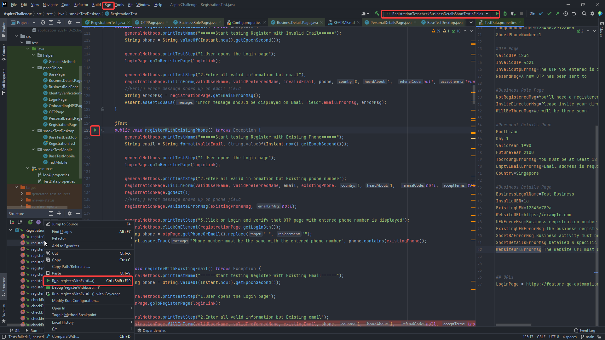

# Aspire Challenge
## Pre-requisite
###Install the following:
- Maven at [here](https://maven.apache.org/) and follow the [installation instruction](https://maven.apache.org/install.html)
- IntelliJ Idea at [here](https://www.jetbrains.com/idea/download/)
- Git (if not installed)
- Chrome and Firefox

## How to run
1. Clone the project and open it with IntelliJ Idea
2. All Configuration settings of the project are put in **Config.properties** file. Default is already ready-to-run

#### Run using maven
3. To run all test cases, just simply using this command: `mvn surefire-report:report` . **Note**: `mvn test` is fine, but it will not generate a html report (just xml report)
4. To run selected test cases, use this command: `mvn -Dtest=RegistrationTest#{Test_Method1_Name}+{Test_Method2_Name} test`

#### Run using IDE
3. Since this project use JUnit4, so IntelliJ or Eclipse will natively support it. Just click on any run button to start running test

**Note**: 
- Since it's only 3 days development, so the tests might not be very stable. There is still room for improvement and it will take time.
- Visual UI regression test is available and applied only to some selected test for demonstration purpose. 
To identify the test case with Visual UI Regression, just notice that it includes the method named: `compareImagesAshot` or `compareImagesSB`
First time running test with Visual UI Regression test, images will be collected and placed into **Reference** folder. 
From the 2nd run, it will take screenshot of webpage/element and compare with the image in **Reference** folder. 
Image with difference highlighted is placed in **Diff** folder. 
